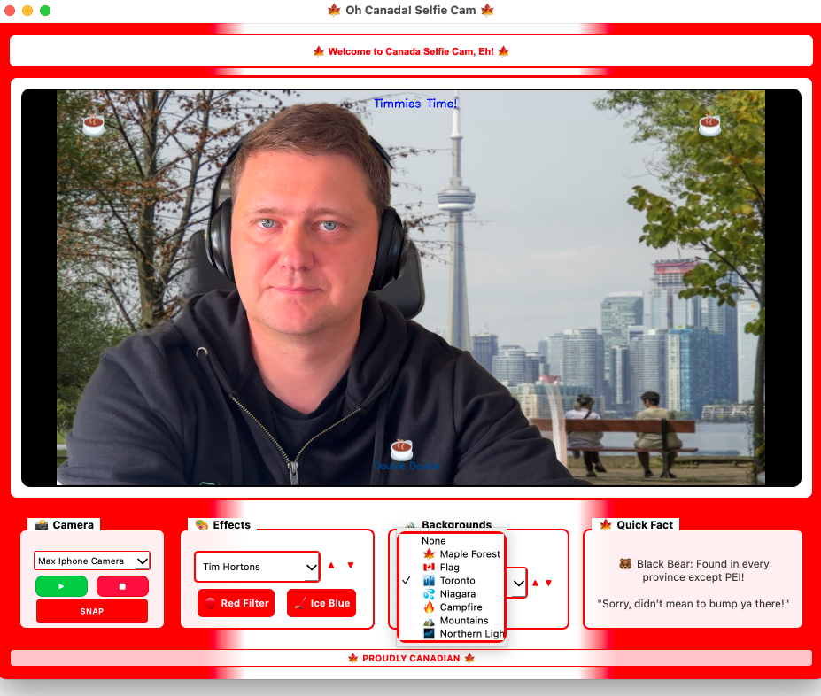

# Canada Selfie App 🍁

[](https://github.com/menemy/canada-selfie-app/actions)
[](https://github.com/menemy/canada-selfie-app/actions)
[](https://opensource.org/licenses/MIT)
[](https://github.com/menemy/canada-selfie-app/releases)

A fun webcam application with Canadian-themed effects, filters, and AI-powered background removal!

Take amazing selfies with maple leaves, snow effects, hockey sticks, and iconic Canadian backgrounds. Show your Canadian pride, eh! 🇨🇦



## ⚠️ Important Notice

**First launch may take 1-2 minutes!** The app needs to:
- Download AI model for background removal (~180MB on first run)
- Request camera permissions
- Initialize video processing

Please be patient and wait for the window to appear. Subsequent launches will be much faster.

## Quick Start

1. Install Python 3.7+
2. Install dependencies:
   ```bash
   pip install -r requirements.txt
   ```
3. Run the app:
   ```bash
   # Direct execution
   python3 canada_selfie_app.py
   
   # Using scripts
   ./run_canada_selfie.sh    # macOS/Linux
   run_canada_selfie.bat     # Windows
   ```

## Building Standalone Executables

### Quick Build
```bash
# Universal builder (recommended)
./build_all.sh

# Platform-specific
./build_exe.sh           # macOS/Linux executable
build_exe.bat            # Windows executable  
./build_dmg.sh           # macOS DMG installer
```

### Manual Build
```bash
# Install PyInstaller
pip install pyinstaller

# Build executable
pyinstaller canada_selfie.spec

# macOS: Create DMG
./build_dmg.sh
```

### Distribution Files
- **Windows**: `dist/CanadaSelfieApp.exe` (portable single file)
- **macOS**: `Canada-Selfie-App.dmg` (installer)
- **Linux**: `dist/CanadaSelfieApp` (executable)

### ⚠️ Security Notice

The app binaries are currently **not code-signed**. You may see security warnings when running:

**macOS**: 
- Right-click the app and select "Open" 
- Click "Open" in the security dialog
- This only needs to be done once

If you see "Canada Selfie is damaged and can't be opened", remove the quarantine attribute:
```bash
# For app in Applications folder
xattr -cr "/Applications/Canada Selfie.app"

# For DMG file
xattr -cr ~/Downloads/Canada-Selfie-App.dmg
```

**Windows**:
- Click "More info" on the SmartScreen warning
- Click "Run anyway"
- Or right-click the .exe file → Properties → check "Unblock"

## Features

- 🍁 **8 Canadian Effects**: Maple rain, snow fall, hockey sticks, beaver dam, flag frame, Tim Hortons, moose trail, northern stars
- 🏔️ **7 Background Scenes**: Maple forest, Canadian flag, Toronto skyline, Niagara Falls, campfire, Rocky Mountains, northern lights
- 🎨 **Color Filters**: Red filter and ice blue hockey filter
- 📸 **Photo Capture**: Save your selfies with timestamp
- 📷 **Multi-Camera Support**: Automatic detection with proper camera names
- 🤖 **AI Background Removal**: Optional rembg integration for clean background replacement
- 🎉 **Secret Easter Eggs**: Discover hidden Canadian surprises!

## System Requirements

- **Python**: 3.7+ 
- **Platform**: Windows, macOS, or Linux
- **Hardware**: Webcam, 4GB+ RAM
- **Dependencies**: PyQt5, OpenCV, NumPy

## Optional AI Features

For background removal, install:
```bash
pip install rembg
```
Note: First run downloads ~180MB AI model. Works best on Apple Silicon Macs.

## Troubleshooting

### Log Files
The app creates detailed logs for debugging:

**Windows**: `%APPDATA%\CanadaSelfieApp\canada_selfie_*.log`
- Example: `C:\Users\YourName\AppData\Roaming\CanadaSelfieApp\`

**macOS/Linux**: `~/.canada_selfie/canada_selfie_*.log`
- Example: `/Users/YourName/.canada_selfie/`

### AI Model Location
Downloaded AI models are stored in:

**Windows**: `%USERPROFILE%\.u2net\`
- Example: `C:\Users\YourName\.u2net\u2netp.onnx`

**macOS/Linux**: `~/.u2net/`
- Example: `/Users/YourName/.u2net/u2netp.onnx`

### Common Issues

**Model download fails on Windows**:
- Check log files for detailed error messages
- Ensure you have write permissions to your user directory
- Try running as administrator
- Check network/firewall settings for GitHub access

**"DLL load failed" error on Windows**:
- Install Microsoft Visual C++ Redistributable 2019 or newer
- Try running from Command Prompt to see detailed errors
- Check if Windows Defender is blocking DLLs
- For persistent issues, build from source using `build_exe_windows.bat`

**Background removal not working**:
- Check if model file exists in `.u2net` directory
- Delete corrupted model and restart app to re-download
- Review log files for import errors

## Screenshots

[Add screenshots of the app in action]

## Contributing

1. Fork the repository
2. Create a feature branch
3. Make your changes
4. Test thoroughly
5. Submit a pull request

## License

MIT License - see LICENSE file for details.

## Acknowledgments

- Built with PyQt5 and OpenCV
- AI background removal by [rembg](https://github.com/danielgatis/rembg)
- Canadian spirit and maple syrup power! 🍁

---

**Made with ❤️ and 🇨🇦 Canadian pride!**